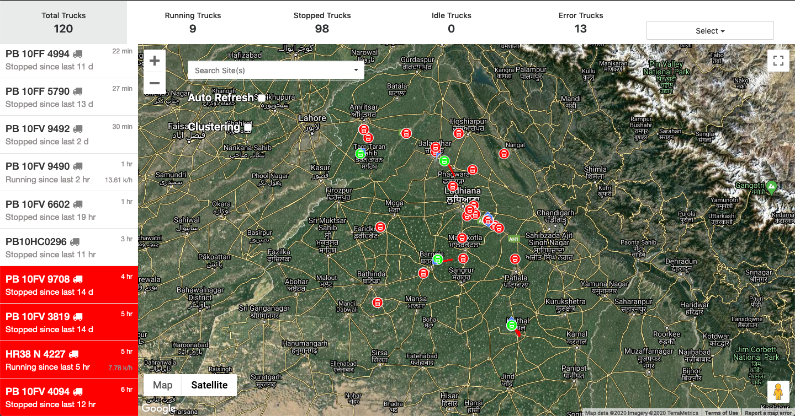
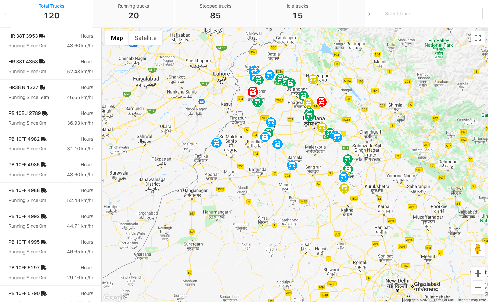
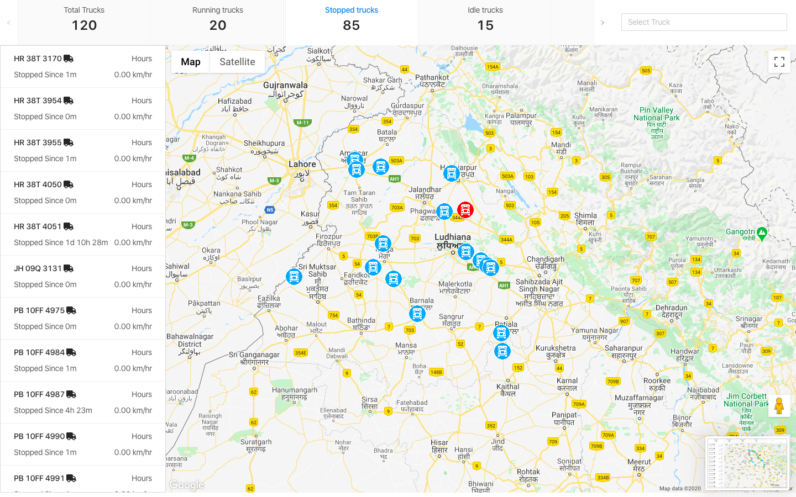
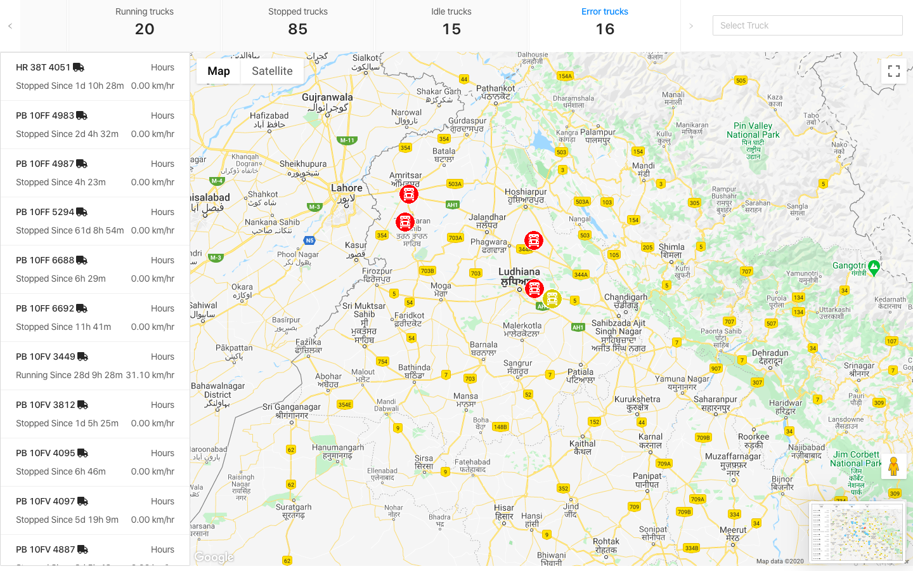
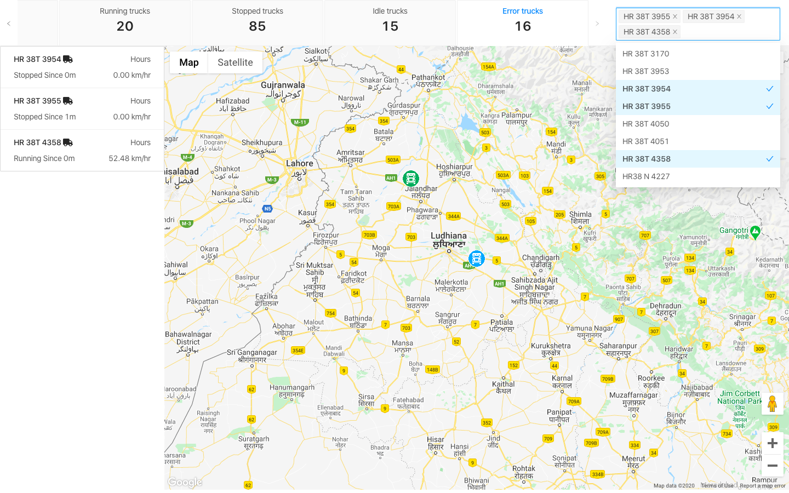

# Truck Tracking System with Realtime API - Remote State

### Truck Tracking System with Realtime API - Remote State

- [x] frontend  - Netlify
- [x] API - mystral

This project was bootstrapped with [Create React App](https://github.com/facebook/create-react-app).

## Available Scripts

In the project directory, you can run:

### `npm install`
### `npm start`

Runs the app in the development mode. 
Open [http://localhost:3000](http://localhost:3000) to view it in the browser.

The page will reload if you make edits. 
You will also see any lint errors in the console.# Truck Tracking System with Realtime API - Remote State

## Problem Statement

Instructions:
1.	Use Google maps to show map view.
2.	You can choose any Javascript framework to build this page.
3.	Use this link for the page screenshot.
4.	Use this link for the reference video of the web page.
5.	Site search box, clustering and auto refresh checkbox are not needed in final solution.
User Interface:
The UI consists of 3 sections:
1.	Top Bar: This section is showing the count of trucks in various states. Also, there is a filter button on the right side of the bar which shows all trucks in drop down and the user can select multiple trucks to filter in all sections. The states are as follows: 
a.	Total Trucks - Total trucks count - Clicking on this section will show all the trucks.
b.	Running Trucks - Trucks in moving state - Clicking on this section will show only running  trucks in the list and map section.
c.	Stopped Trucks - Trucks which are stopped at the moment and ignition is off - Clicking on this section will show only stopped trucks in the list and map section.
d.	Idle Trucks - Trucks which are stopped at the moment but ignition is on - Clicking on this section will show only idle trucks in the list and map section.
e.	Error Trucks - Trucks which haven’t responded from the last 4 hours - Clicking on this section will show only error trucks in the list and map section.
2.	Side Bar: This section is showing the list of trucks and one input box to search the list below. List item is showing:
a.	Truck Number: Top left of list item.
b.	Last updated: Top right of list item.
c.	Running/Stopped state: Bottom left of list item.
d.	Speed of running trucks: Bottom right of list item.
	The list item will be in the red background if the truck is in error state.
3.	Map Section: It is showing the current position of all the trucks. Please use a map marker to show the position of a truck. Also, each marker should be in of a different color according to the truck state:
a.	Running - Green marker
b.	Stopped - Blue marker
c.	Idle - Yellow marker
d.	Error - Red marker.

 
Skip through payment process but ensure the final screen has the details of the movie booked with an option to cancel.

## Demo Link
Open Here  - 
[ **Demo** ](https://trucktrackingapp.netlify.com/)

### Tech / Stack:

 HTML5
 CSS3 
 JavaScript
 React 
 Redux & JSON
 Google Maps
 
### Features implemented:
- [x] movies by Location
- [x] Filter by genre and language.
- [x] Select Movie & check details
- [x] Select Seats & get Price
- [x] Reset selection
- [x] Confirm Bookings
- [x] Print Tickets

Required UI : 

 

My UI :
 
Step 1 : 

Step 2 : 
 

Step 3 : 
 

Step 4 : 
 

Step 5 : 
 

